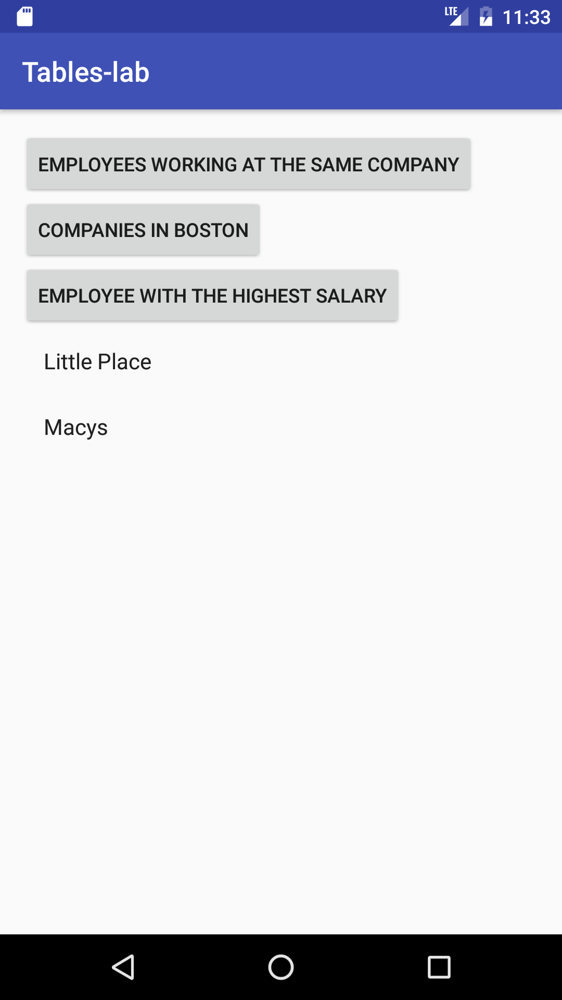

#  Relationships between Tables

## Introduction

> ***Note:*** _This should be done independently._

In this lab, you will create an app with a database with two tables - Employee and Job.  

Employee table should have the following data:  

    

Job table should look like this:  

     

The main purpose of the app is to provide information, which is present in two tables:  

1.  show the full name of employees working at Macys
2.  show the companies located in Boston  
3.  show the full name of the employee with the highest salary  

Your app doesn't need to look like the screenshot, but it needs to have the same functionality.

## Exercise

#### Requirements

The Main Activity should:  

- Populate the database when launched
- Contain 3 buttons that display their results in a RecyclerView:

    * **employees working at macys** - the button that will return the full names of employees working at Macys
    * **companies in Boston** - the button that will return companies located in Boston
    * **company with the highest salary** - the button that will return the employee name with the highest salary

**Bonus:** Use SQLiteQueryBuilder to form your joins

#### Deliverable

A working app that meets the requirements above.

